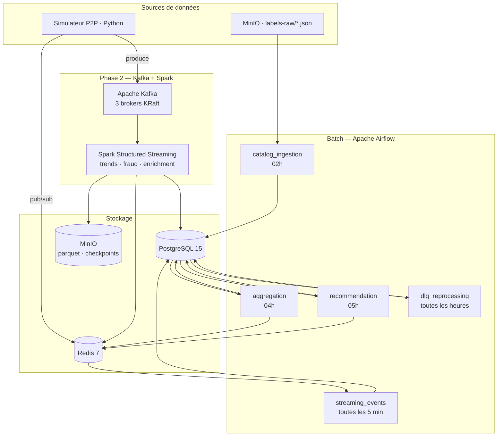

# SPOTIFY — Plateforme de streaming musical distribuée — Groupe M

> Formation Data & IA — Master 1 | HETIC 2025/2026

## Architecture




---

## Démarrage rapide

```bash
git clone https://github.com/hlrnGH/data_pipelines.git
cd data_pipelines
cp .env.example .env
docker compose up -d
```

- Airflow : http://localhost:8080 (admin / admin)
- MinIO : http://localhost:9001 (minioadmin / minioadmin)
- Kafka UI : http://localhost:8090 (Phase 2)

---

## Organisation Git

```
main
├── feat/batch-pipelines    ← Phase 1 (#1 → #10)
├── feat/kafka-streaming    ← Phase 2 (#11 → #20)
└── feat/inter-group        ← Phase 3 (#21 → #25)
```

## Équipe

| Membre            | Tickets     |
| ----------------- | ----------- |
| Nassim (référent) | #1, #2, #10, #12, #15, #17, #18, #19, #20 |
| Rodrigue          | #3, #4, #6, #11, #13  |
| Omar              | #5, #7, #14, #16      |
| Harold            | #8          |
| Jiek              | #9,          |
