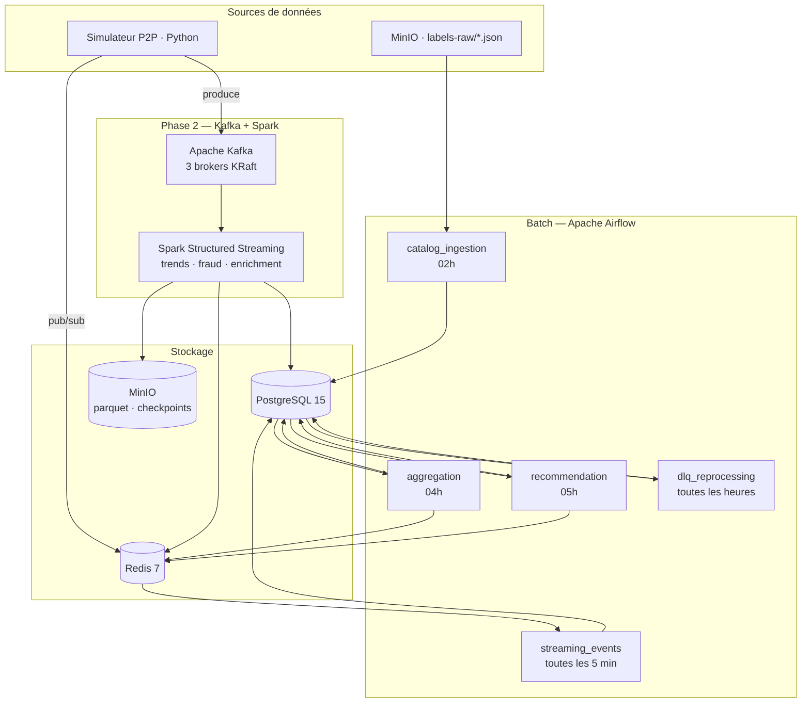

# Architecture SPOTIFY — Groupe M

---

## Vision d'ensemble



---

## Décisions architecturales

### ETL vs ELT — Mapping par pipeline

| Pipeline                   | Approche | Justification                                                                                                             |
| -------------------------- | -------- | ------------------------------------------------------------------------------------------------------------------------- |
| `catalog_ingestion`        | **ETL**  | Extract depuis MinIO → Transform (validation, normalisation) → Load PostgreSQL. Données nettoyées avant insertion.        |
| `streaming_events`         | **ELT**  | Extract depuis Redis → Load brut dans PostgreSQL → Transform via SQL. La base fait le travail d'agrégation.               |
| `aggregation`              | **ELT**  | Données déjà dans PostgreSQL → Transform par SQL (SUM, GROUP BY) → Load dans `daily_streams`. Transformation in-database. |
| `streaming_trends` (Spark) | **ELT**  | Extract depuis Kafka → Load dans Spark → Transform (fenêtres, agrégats) → Write PostgreSQL/Redis.                         |
| `dlq_reprocessing`         | **ETL**  | Extract depuis `dead_letter_events` → Transform (correction) → Load dans la table cible. On corrige avant de réinsérer.   |

**Règle du groupe :**
- **ETL** quand les données doivent être validées avant d'entrer en base
- **ELT** quand la transformation peut se faire en SQL ou via un moteur externe (Spark)

---

### Partitionnement Parquet

```
spotify-parquet/
└── listening_events/
    └── date=2025-01-15/
        └── hour=14/
            └── part-00000.parquet
```

Partitionnement par `date` puis `hour` — aligné sur les fenêtres horaires de l'index `date_trunc('hour', timestamp)` de PostgreSQL. Cela permet au DAG d'agrégation de traiter chaque heure en parallèle sans scanner l'ensemble des données.

---

### Topics Kafka

| Topic                | Partitions | Clé       | Usage                     |
| -------------------- | ---------- | --------- | ------------------------- |
| `listening-events`   | 6          | `user_id` | Écoutes du simulateur P2P |
| `p2p-network-events` | 3          | `peer_id` | Événements réseau P2P     |
| `dlq-events`         | 1          | -         | Dead Letter Queue Kafka   |
| `fraud-alerts`       | 3          | `user_id` | Alertes fraude Spark      |

**Pourquoi `user_id` comme clé pour `listening_events` ?**
Pour garantir que tous les événements d'un même utilisateur arrivent dans la même partition. Cela permet au job Spark de détecter les patterns bot par utilisateur sans avoir à fusionner des données de plusieurs partitions — essentiel pour `fraud_detection_job` qui travaille en mode stateful.

---

## Choix techniques

### Pourquoi CeleryExecutor (pas KubernetesExecutor) ?

CeleryExecutor est adapté à notre contexte de développement local sous Docker Compose. Il ne nécessite pas de cluster Kubernetes, s'installe simplement avec Redis comme broker de messages, et permet de scaler les workers facilement. KubernetesExecutor serait plus adapté à un environnement de production cloud, mais représente une complexité inutile pour un projet de 5 jours en local.

### Gestion des secrets

Les credentials (PostgreSQL password, MinIO keys, Airflow secret key) sont gérés via le fichier `.env` (copié depuis `.env.example`). Ce fichier est exclu du repo via `.gitignore` — on ne commite jamais de secrets. En production, on utiliserait Airflow Connections ou un gestionnaire de secrets comme HashiCorp Vault.

---

## Architecture Lambda — Batch + Speed Layer

```
Speed layer  : Simulateur → Kafka → Spark → PostgreSQL (realtime_*) + Redis
Batch layer  : Simulateur → Redis → Airflow → PostgreSQL (daily_*) + MinIO
Serving layer: PostgreSQL + Redis ← consommé par les clients
```

**Ce qui est en batch et pourquoi :**
Le catalogue (`catalog_ingestion`), les agrégats journaliers (`daily_streams`, `artist_stats`) et les recommandations sont calculés en batch. Ces données n'ont pas besoin d'être à la seconde — une fraîcheur à J ou J+1 suffit. Le batch permet de traiter de gros volumes de façon fiable avec retry automatique (Airflow) et d'utiliser des requêtes SQL complexes sans contrainte de latence.

**Ce qui est en streaming et pourquoi :**
Le Top 50 live, les alertes fraude et les tendances temps réel (`realtime_top_tracks`) passent par Spark Streaming. Ces cas d'usage ont une valeur qui décroît rapidement : une alerte fraude détectée 1h après est inutile, un Top 50 vieux de 24h n'est pas "live". La latence de quelques secondes justifie la complexité supplémentaire du streaming.

---

## Schémas d'événements

### listening_event

```json
{
  "event_id":    "uuid",
  "user_id":     "uuid",
  "track_id":    "uuid",
  "source_peer": "uuid",
  "timestamp":   "2025-01-15T14:30:00Z",
  "duration_ms": 45000,
  "device_type": "mobile",
  "geo_country": "FR",
  "completed":   true,
  "event_source": "p2p"
}
```

### p2p_network_event

```json
{
  "event_id":        "uuid",
  "event_type":      "chunk_transfer",
  "peer_id":         "uuid",
  "target_peer":     "uuid",
  "track_id":        "uuid",
  "chunk_size_bytes": 65536,
  "latency_ms":      12,
  "timestamp":       "2025-01-15T14:30:01Z"
}
```

---

## Leçons apprises

- **Lundi** : Les chemins avec espaces bloquent les mounts Docker sur Mac. Toujours travailler dans un dossier sans espace (`~/data_pipelines`). Le WiFi de la salle est saturé quand tout le monde pull les images en même temps — prévoir un hotspot.
- **Mardi** : L'ordre d'activation des DAGs compte — `aggregation_pipeline` attend `streaming_events_pipeline`. Toujours activer dans l'ordre de la chaîne de dépendances.
- **Mercredi** : En cours...
- **Jeudi** : En cours...
- **Vendredi** : En cours...