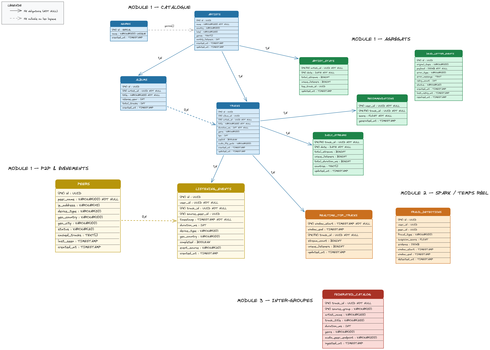

# Modèle de données — SPOTIFY `sql/init_spotify_db.sql`.

---

## Diagramme ERD



---

## Questions de conception

### Pourquoi `listening_events` est indexé sur `(timestamp)` ET `date_trunc('hour', timestamp)` ?

Deux usages distincts, deux index :

- **`(timestamp)`** : couvre les requêtes de plage temporelle (`WHERE timestamp > NOW() - INTERVAL '24h'`). Sans lui, chaque filtre temporel = full table scan.

- **`date_trunc('hour', timestamp)`** : index fonctionnel qui couvre les agrégations par heure (`GROUP BY date_trunc('hour', timestamp)`). Le DAG d'agrégation traite les événements heure par heure en parallèle. Sans cet index, chaque agrégation horaire scanne toute la table.

En résumé : un index pour **filtrer**, un pour **agréger et paralléliser**.

---

### Quelle est la différence entre `daily_streams` (batch) et `realtime_top_tracks` (Spark) ?

| Critère           | `daily_streams`                    | `realtime_top_tracks`              |
| ----------------- | ---------------------------------- | ---------------------------------- |
| **Alimentée par** | Airflow DAG (#7)                   | Spark Streaming (#14)              |
| **Fréquence**     | Une fois par jour                  | En continu (fenêtres 5 min)        |
| **Latence**       | Heures                             | Secondes                           |
| **Contenu**       | Totaux définitifs par morceau/jour | Top tracks sur la fenêtre courante |
| **Persistance**   | Permanent (historique)             | Écrasé à chaque fenêtre            |
| **Usage**         | Reporting, tendances historiques   | Leaderboard live, Redis Top 50     |

---

### Pourquoi `dead_letter_events.payload` est `JSONB` plutôt que `TEXT` ?

1. **Requêtabilité** : avec `JSONB` on filtre sur les champs internes — `WHERE payload->>'event_source' = 'p2p'`. Avec `TEXT` il faudrait parser le JSON à chaque requête.

2. **Indexation** : un index GIN sur `payload` permet des recherches rapides par contenu.

3. **Reprocessing ciblé** : le DAG `dlq_reprocessing` (#9) identifie les événements à corriger via une simple clause `WHERE` — impossible efficacement avec `TEXT`.

---

## Validation

```bash
docker compose exec postgres psql -U spotify spotify -c "\dt"
# → 13 tables listées
```


> **RQ** : FRAUD_DETECTIONS et FEDERATED_CATALOG n'ont pas de flèches car pas de FK vers les tables locales — c'est voulu, elles sont alimentées en Phase 2 et 3